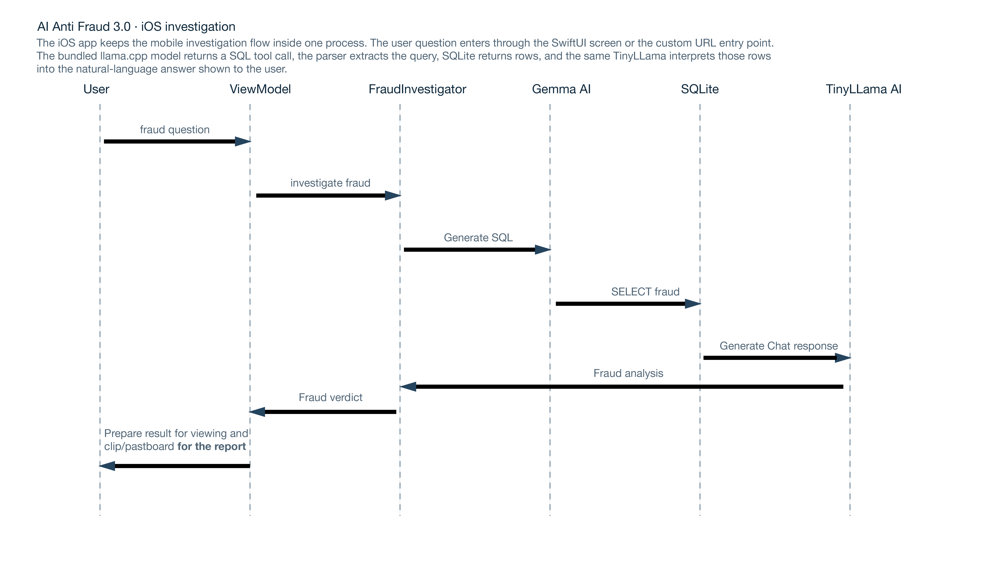
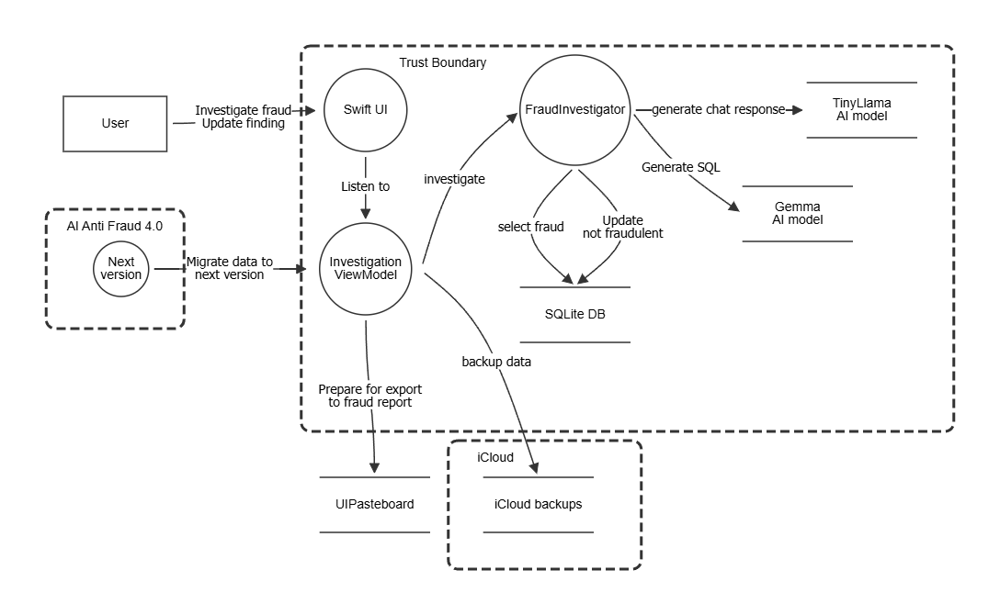
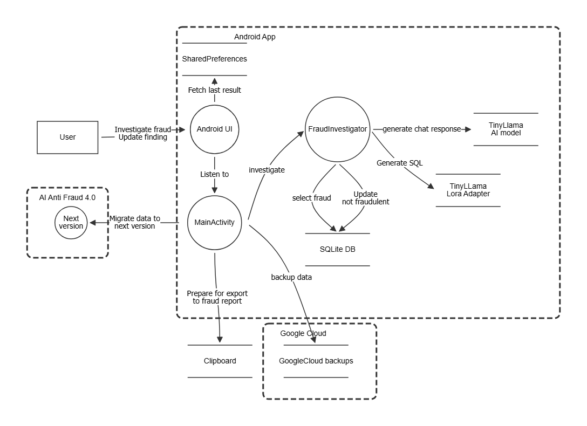

# PwnedNext - LLM Mobile App Cheat Sheet

## High-Level Architecture of AI Anti-Fraud 3.0 - IOS

## High-Level Architecture of AI Anti-Fraud 3.0 - Android

## Fraud Investigation LLM Application — Cheat Sheet

Applicable threats for the LLM-based fraud investigation mobile apps. Each entry links to a page explaining how the threat manifests in this application and what mitigations are needed. The threats are sorted according to the face value of the Cornucopia card in question.

---

## Vulnerable apps

- [Android implementation](https://github.com/owaspcornucopia/llm-companion-scenario-android)
- [iOS implementation](https://github.com/owaspcornucopia/llm-companion-scenario-ios)

## Applicable Threats

### Platform & Code

| Card | Applicable | Deliberate Android behavior | MASTG / MASWE mapping | Details |
|---|---:|---|---|---|
| [PC2](https://cornucopia.owasp.org/cards/PC2) | true | Visible SQL and rows are capturable in screenshots and recents previews. | TEST-0289--0294; BEST-0014, 0015, 0017, 0018, 0033; MASWE-0038, 0034 | [PC2 help](help/PC2.md) |
| [PC3](https://cornucopia.owasp.org/cards/PC3) | true | Full unmasked results, clipboard export, and unnecessary component permissions expose data. | TEST-0316, 0320, 0346, 0347, 0378, 0390; MASWE-0036, 0001, 0034, 0066 | [PC3 help](help/PC3.md) |
| [PC4](https://cornucopia.owasp.org/cards/PC4) | true | Location, camera, microphone, media, and notification permissions are declared without a feature need. | TEST-0254--0257, 0360--0363; MASWE-0066 | [PC4 help](help/PC4.md) |
| [PC5](https://cornucopia.owasp.org/cards/PC5) | true | An exported receiver accepts attacker-controlled questions and approval extras. | TEST-0372, 0374, 0375; MASWE-0032, 0050 | [PC5 help](help/PC5.md) |
| [PC6](https://cornucopia.owasp.org/cards/PC6) | true | Receiver and providers are exported without signature-level protection. | TEST-0364--0366, 0381; MASWE-0018, 0032 | [PC6 help](help/PC6.md) |
| [PC7](https://cornucopia.owasp.org/cards/PC7) | true | Exported provider concatenates an external WHERE clause into raw SQLite. | TEST-0339, 0355--0357; MASWE-0050, 0018 | [PC7 help](help/PC7.md) |
| [PC8](https://cornucopia.owasp.org/cards/PC8) | true | Exported file provider joins caller paths without canonical containment checks. | TEST-0357; MASWE-0018 | [PC8 help](help/PC8.md) |
| [PC9](https://cornucopia.owasp.org/cards/PC9) | true | Broadcast extras and provider selections reach sensitive operations without a strict input schema. | MASTG/MASWE IPC validation review | [PC9 help](help/PC9.md) |
| [PCX](https://cornucopia.owasp.org/cards/PCX) | true | Android targets API 35 while current Play policy requires API 36 for new apps/updates, and iOS permits deployment to iOS 15 without an enforced recent-platform baseline. | TEST-0245, 0272--0275, 0331, 0382--0384, 0392; BEST-0032; KNOW-0023, 0074, 0076; MASWE-0041, 0043, 0044, 0035 | [PCX help](help/PCX.md) |
| [PCQ](https://cornucopia.owasp.org/cards/PCQ) | true | Exported components accept attacker-controlled messages, queries, approval state, and paths. | MASTG/MASWE IPC review | [PCQ help](help/PCQ.md) |

### Network & Storage

| Card | Applicable | Deliberate Android behavior | MASTG / MASWE mapping | Details |
|---|---:|---|---|---|
| [NS2](https://cornucopia.owasp.org/cards/NS2) | true | Questions, SQL, and rows are written to Logcat. | TEST-0203, 0231, 0296, 0297; MASWE-0005 | [NS2 help](help/NS2.md) |
| [NS3](https://cornucopia.owasp.org/cards/NS3) | true | Complete investigation results are copied to a clipboard that is never cleared. | TEST-0258, 0276--0280, 0313, 0314; MASWE-0036 | [NS3 help](help/NS3.md) |
| [NS4](https://cornucopia.owasp.org/cards/NS4) | true | Local SQLite and on-device model prompts expose transaction data inside the app process. | TEST-0206, 0315, 0318, 0319; MASWE-0073, 0037 | [NS4 help](help/NS4.md) |
| [NS5](https://cornucopia.owasp.org/cards/NS5) | true | Backups remain enabled and the file provider can reach app-private paths. | TEST-0200, 0201, 0207, 0215, 0216, 0262, 0287, 0298, 0304--0306; MASWE-0002, 0001, 0006 | [NS5 help](help/NS5.md) |
| [NS6](https://cornucopia.owasp.org/cards/NS6) | true | Reviews and approvals work without checking for a secure device lock or trusted device state. | MASTG/MASWE device-access review | [NS6 help](help/NS6.md) |
| [NS7](https://cornucopia.owasp.org/cards/NS7) | true | Full prompts, SQL, rows, and memo values remain in activity memory. | KNOW-0051, 0103 | [NS7 help](help/NS7.md) |
| [NS8](https://cornucopia.owasp.org/cards/NS8) | true | Last results and fraud overrides are stored in ordinary SharedPreferences. | TEST-0200, 0201, 0207, 0299--0306, 0338, 0387; MASWE-0002, 0001, 0057 | [NS8 help](help/NS8.md) |
| [NS9](https://cornucopia.owasp.org/cards/NS9) | true | A restored or edited preference changes report authorization behavior without entering the model prompt. | TEST-0338, 0387; MASWE-0057 | [NS9 help](help/NS9.md) |

### Authentication & Authorization

| Card | Applicable | Deliberate Android behavior | MASTG / MASWE mapping | Details |
|---|---:|---|---|---|
| [AA2](https://cornucopia.owasp.org/cards/AA2) | true | High-value approval succeeds without fresh authentication or biometrics. | TEST-0266--0269; MASWE-0020, 0021 | [AA2 help](help/AA2.md) |
| [AA7](https://cornucopia.owasp.org/cards/AA7) | true | Client-supplied authorization and replayed approval tokens can clear a transaction's `fraud_detected` flag. | TEST-0266, 0267, 0327, 0329, 0375; MASWE-0020, 0050 | [AA7 help](help/AA7.md) |
| [AA8](https://cornucopia.owasp.org/cards/AA8) | true | Missing authorization state defaults to allow. | TEST-0266, 0267, 0327; MASWE-0020 | [AA8 help](help/AA8.md) |
| [AA9](https://cornucopia.owasp.org/cards/AA9) | true | Activity, receiver, query provider, and file provider have broad access. | TEST-0250--0257, 0335, 0336, 0360--0363; MASWE-0034, 0066 | [AA9 help](help/AA9.md) |
| [AAQ](https://cornucopia.owasp.org/cards/AAQ) | true | Intent extras and provider arguments reach investigation data without caller authorization. | MASTG/MASWE authorization and IPC review | [AAQ help](help/AAQ.md) |

### Resiliency

| Card | Applicable | Deliberate Android behavior | MASTG / MASWE mapping | Details |
|---|---:|---|---|---|
| [RS2](https://cornucopia.owasp.org/cards/RS2) | true | Verbose debug diagnostics remain in the production-shaped training build. | TEST-0263--0265, 0358, 0359; MASWE-0061 | [RS2 help](help/RS2.md) |
| [RS3](https://cornucopia.owasp.org/cards/RS3) | true | Debug metadata, readable strings, and security-sensitive implementation details remain in the APK. | TEST-0219, 0288; MASWE-0061 | [RS3 help](help/RS3.md) |
| [RS4](https://cornucopia.owasp.org/cards/RS4) | true | No package, model, installer, or restored-data integrity verification exists. | TEST-0220, 0224, 0225; MASWE-0075, 0056 | [RS4 help](help/RS4.md) |
| [RS5](https://cornucopia.owasp.org/cards/RS5) | true | The debug APK is explicitly debuggable and runtime-inspectable. | TEST-0226, 0227, 0261; MASWE-0063 | [RS5 help](help/RS5.md) |
| [RS7](https://cornucopia.owasp.org/cards/RS7) | true | Emulator and hostile-device detection is absent. | TEST-0351, 0367; MASWE-0054, 0053 | [RS7 help](help/RS7.md) |
| [RS8](https://cornucopia.owasp.org/cards/RS8) | true | Sensitive Java and JNI operations run without runtime-instrumentation detection. | MASTG/MASWE resilience review | [RS8 help](help/RS8.md) |
| [RS9](https://cornucopia.owasp.org/cards/RS9) | true | Minification is disabled, leaving readable classes, strings, SQL, and model assets. | MASTG/MASWE reverse-engineering review | [RS9 help](help/RS9.md) |
| [RSJ](https://cornucopia.owasp.org/cards/RSJ) | true | Model files, preferences, and database state are trusted without authenticity checks. | MASTG/MASWE file-integrity review | [RSJ help](help/RSJ.md) |
| [RSQ](https://cornucopia.owasp.org/cards/RSQ) | true | No runtime response protects model output, authorization helpers, or fraud decisions from hooks. | MASTG/MASWE runtime-integrity review | [RSQ help](help/RSQ.md) |
| [RSX](https://cornucopia.owasp.org/cards/RSX) | true | Rooted, instrumented, and infected environments receive full functionality. | MASTG/MASWE platform-integrity review | [RSX help](help/RSX.md) |
| [RSA](https://cornucopia.owasp.org/cards/RSA) | true? | No weak anti-debugging control exists to bypass, but specific resilience attacks could be invented by the player. | <none> | [RSA help](help/RSA.md) | 

### Cryptography

| Card | Applicable | Deliberate Android behavior | MASTG / MASWE mapping | Details |
|---|---:|---|---|---|
| [CRM2](https://cornucopia.owasp.org/cards/CRM2) | true | One hard-coded AES key and fixed IV are reused for different purposes. | TEST-0307, 0308; MASWE-0007 | [CRM2 help](help/CRM2.md) |
| [CRM3](https://cornucopia.owasp.org/cards/CRM3) | true | Every encryption operation uses the same predictable IV. | MASTG/MASWE cryptography review | [CRM3 help](help/CRM3.md) |
| [CRM4](https://cornucopia.owasp.org/cards/CRM4) | true | The AES key is a readable product string rather than random key material. | MASTG/MASWE key-generation review | [CRM4 help](help/CRM4.md) |
| [CRM6](https://cornucopia.owasp.org/cards/CRM6) | true | AES-CBC ciphertext has no MAC or authenticated-encryption tag. | MASTG/MASWE integrity review | [CRM6 help](help/CRM6.md) |
| [CRM7](https://cornucopia.owasp.org/cards/CRM7) | true | The app uses an APK-embedded key instead of Android Keystore. | MASTG/MASWE key-storage review | [CRM7 help](help/CRM7.md) |
| [CRM8](https://cornucopia.owasp.org/cards/CRM8) | true | The readable fixed key, reused IV, unauthenticated CBC, and iOS XOR fallback make the effective cryptographic strength far below the expected attacker effort. | TEST-0208, 0209, 0210, 0211, 0221, 0232, 0312, 0317, 0350; BEST-0005, 0009, 0020; KNOW-0011, 0012; MASWE-0007, 0008, 0013 | [CRM8 help](help/CRM8.md) |
| [CRM9](https://cornucopia.owasp.org/cards/CRM9) | true | AES-CBC with a fixed IV produces repeatable ciphertext patterns. | MASTG/MASWE cipher-configuration review | [CRM9 help](help/CRM9.md) |
| [CRMX](https://cornucopia.owasp.org/cards/CRMX) | true | Attackers can recover the reusable AES key from the APK. | MASTG/MASWE hard-coded-key review | [CRMX help](help/CRMX.md) |
| [CRMQ](https://cornucopia.owasp.org/cards/CRMQ) | true | Android and iOS helpers use a readable AES key and fixed IV without ciphertext authentication; iOS also has a repeating-key XOR fallback. | TEST-0210, 0211, 0221, 0232; BEST-0005, 0009; KNOW-0068; MASWE-0007, 0008 | [CRMQ help](help/CRMQ.md) |
| [CRMK](https://cornucopia.owasp.org/cards/CRMK) | true | Android and iOS cryptographic calls can be intercepted or replaced on instrumented builds; no runtime hook detection protects the operation, and iOS has an XOR fallback. | TEST-0341, 0354; BEST-0041, 0048; KNOW-0030, 0032, 0087, 0118; MASWE-0058 | [CRMK help](help/CRMK.md) |

### Cornucopia

| Card | Applicable | Deliberate Android behavior | MASTG / MASWE mapping | Details |
|---|---:|---|---|---|
| [CM8](https://cornucopia.owasp.org/cards/CM8) | true | Unprotected exported components let another app start reviews and provide approval state. | MASTG/MASWE delegated-action review | [CM8 help](help/CM8.md) |
| [CMX](https://cornucopia.owasp.org/cards/CMX) | true | A caller-controlled path can escape the provider's intended reports directory. | MASTG/MASWE path-traversal review | [CMX help](help/CMX.md) |
| [CMQ](https://cornucopia.owasp.org/cards/CMQ) | true | A future APK/IPA delivery channel lacks app attestation and signed-update requirements, allowing a MITM or compromised publisher to distribute a modified build. | TEST-0220, 0341, 0354; BEST-0041, 0048; KNOW-0030, 0032, 0058, 0087, 0118, 0140; MASWE-0056, 0058 | [CMQ help](help/CMQ.md) |
| [CMK](https://cornucopia.owasp.org/cards/CMK) | true | Prompt-influenced model answer, SQL, and rows are forwarded to Android Clipboard or iOS UIPasteboard without source, type, or safety validation. | TEST-0375; BEST-0057; KNOW-0025, 0081, 0138; MASWE-0050 | [CMK help](help/CMK.md) |

### Large Language Models

| Value | Applicable | Threat | Details |
|----|------------|--------|---------|
| 2 | true | No rate limiting — resource exhaustion through unlimited inference requests | [LLM2](help/LLM2.md) |
| 3 | true | Fraud determinations made without human oversight, risk of acting on hallucinations | [LLM3](help/LLM3.md) |
| 4 | true | System prompt and personal data can be extracted through prompt manipulation | [LLM4](help/LLM4.md) |
| 5 | true | Any valid token can access any customer's investigation data — no tenant isolation | [LLM5](help/LLM5.md) |
| 7 | true | Model artifacts are downloaded from HuggingFace without a pinned revision or integrity verification, allowing a poisoned base model or adapter to be deployed | [LLM7](help/LLM7.md) |
| 8 | true | The SQL tool has no access restrictions — executes any query the model produces | [LLM8](help/LLM8.md) |
| 9 | true | Poisoned database records can inject instructions into the model during answer generation | [LLM9](help/LLM9.md) |
| Jack | true | Models downloaded from HuggingFace without integrity verification at deployment | [LLMJ](help/LLMJ.md) |
| King | true | Model executes database queries with no human approval — excessive agency | [LLMK](help/LLMK.md) |
| Queen | true | LLM output fed directly to the SQL engine — improper output handling enables injection | [LLMQ](help/LLMQ.md) |
| 10 | true | User input can override the system prompt — direct prompt injection | [LLMX](help/LLMX.md) |

### Non-Applicable Threats

The remaining cards are deliberately **not selected** and are documented as not applicable.

| Suit | Not-selected cards | Scope reason |
|---|---|---|
| Platform & Code | [PCJ](help/PCJ.md), [PCK](help/PCK.md), [PCA](help/PCA.md) (Only if the user is able to invent a plausible threat) |
| Authentication & Authorization | [AA3](help/AA3.md), [AA4](help/AA4.md), [AA5](help/AA5.md), [AA6](help/AA6.md), [AAX](help/AAX.md), [AAJ](help/AAJ.md), [AAK](help/AAK.md), [AAA](help/AAA.md) (No biometric prompt, keystore unlock flow, URL-scheme login, or separate authorization service.) |
| Network & Storage | [NSJ](help/NSJ.md), [NSX](help/NSX.md), [NSQ](help/NSQ.md), [NSK](help/NSK.md), [NSA](help/NSA.md) (LLM Inference is entirely on-device, so there is no model network path, certificate-pinning, or custom TLS-trust implementation.) |
| Resilience | [RS6](help/RS6.md), [RSK](help/RSK.md), [RSA](help/RSA.md) (Only if the user is able to invent a plausible threat) |
| Cryptography | [CRM5](help/CRM5.md), [CRMJ](help/CRMJ.md), [CRMA](help/CRMA.md) (Only if the user is able to invent a plausible threat) |
| Cornucopia | [CM2](help/CM2.md), [CM3](help/CM3.md), [CM4](help/CM4.md), [CM5](help/CM5.md), [CM6](help/CM6.md), [CM7](help/CM7.md), [CM9](help/CM9.md), [CMJ](help/CMJ.md), [CMA](help/CMA.md) (Only if the user is able to invent a plausible threat) |
| Wild cards | [JOAM](help/JOAM.md), [JOBM](help/JOBM.md) | Open-ended compliance and surveillance cards are not represented. |

## Large Language Models

| Value | Applicable | Reason | Details |
|----|------------|--------|---------|
| 6 | false | No RAG, vector DB, or MCP sources to poison | [LLM6](help/LLM6.md) |
| Ace | false | Creative/novel placeholder — not a specific threat | [LLMA](help/LLMA.md) |