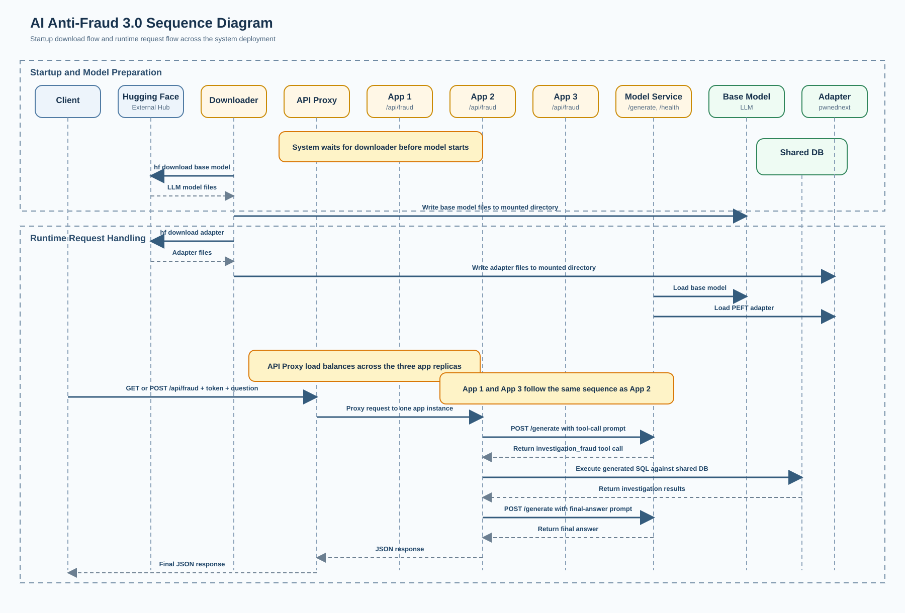
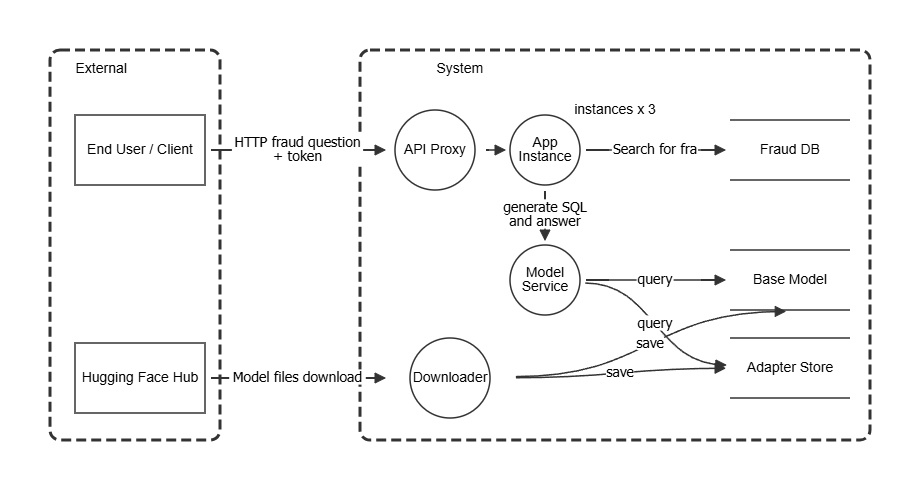

# PwnedNext - LLM App Cheat Sheet

## High-Level Architecture of AI Anti-Fraud 3.0 - Backend

For mobile, see each vulnerable mobile applications.

## Fraud Investigation LLM Application — Cheat Sheet

Applicable threats for the LLM-based fraud investigation API and mobile apps. Each entry links to a page explaining how the threat manifests in this application and what mitigations are needed. The threats are sorted according to the face value of the Cornucopia card in question.

---

## Vulnerable apps

- [Python implementation](https://github.com/owaspcornucopia/llm-companion-scenario)
- [.NET implementation](https://github.com/owaspcornucopia/llm-companion-scenario-dotnet)
- [TypeScript implementation](https://github.com/owaspcornucopia/llm-companion-scenario-typescript)
- [Java implementation](https://github.com/owaspcornucopia/llm-companion-scenario-java)
- [Android implementation](https://github.com/owaspcornucopia/llm-companion-scenario-android)
- [iOS implementation](https://github.com/owaspcornucopia/llm-companion-scenario-ios)

## Data Validation & Encoding

| Value | Applicable | Threat | Details |
|----|------------|--------|---------|
| 2 | true | Error messages and responses reveal internal configuration, SQL queries, and model output | [VE2](help/VE2.md) |
| 3 | true | No validation on user questions — arbitrary length, format, and content accepted | [VE3](help/VE3.md) |
| 4 | true | Input not checked in context — any user can ask about any data | [VE4](help/VE4.md) |
| 9 | true | Validation failures not rejected — fallback parsing accepts malformed output | [VE9](help/VE9.md) |
| 10 | true | Application trusts all data sources (user input, LLM output, database content) | [VEX](help/VEX.md) |
| Jack | true | No centralized validation routines exist to be enforced | [VEJ](help/VEJ.md) |
| King | true | LLM-generated SQL executed directly without parameterization (SQL injection) | [VEK](help/VEK.md) |
| Ace | true | No logging to detect novel attacks against input validation | [VEA](help/VEA.md) |

## Authentication

| Value | Applicable | Threat | Details |
|----|------------|--------|---------|
| 2 | true | Token use is invisible — legitimate owners cannot detect stolen token usage | [AT2](help/AT2.md) |
| 3 | true | Tokens exposed in transit (no TLS) and at rest (plaintext in code) | [AT3](help/AT3.md) |
| 5 | true | Hardcoded debug and backdoor tokens present in source code | [AT5](help/AT5.md) |
| 6 | true | Static tokens never expire, cannot be rotated or revoked | [AT6](help/AT6.md) |
| 10 | true | No centralized authentication framework — hand-written list check | [ATX](help/ATX.md) |
| Jack | true | Token check happens inside the tool function, not at the API endpoint | [ATJ](help/ATJ.md) |
| Ace | true | No logging to detect authentication attacks or token misuse | [ATA](help/ATA.md) |

## Session Management

| Value | Applicable | Threat | Details |
|----|------------|--------|---------|
| 3 | true | Stolen tokens cannot be detected or terminated by the owner | [SM3](help/SM3.md) |
| 6 | true | No session timeout — tokens valid indefinitely | [SM6](help/SM6.md) |
| 7 | true | No logout or token termination capability | [SM7](help/SM7.md) |
| 8 | true | No re-authentication on context changes (new IP, unusual patterns) | [SM8](help/SM8.md) |
| 9 | true | Tokens sent over unencrypted HTTP — interceptable in transit | [SM9](help/SM9.md) |
| Jack | true | No proof of possession — stolen tokens reusable from anywhere | [SMJ](help/SMJ.md) |
| King | true | Self-built token check with no session management framework | [SMK](help/SMK.md) |
| Ace | true | No logging to detect session hijacking or replay attacks | [SMA](help/SMA.md) |

## Authorization

| Value | Applicable | Threat | Details |
|----|------------|--------|---------|
| 3 | true | Data accessible through SQL injection — only token validity is checked, not data scope | [AZ3](help/AZ3.md) |
| 4 | true | Authorization design does not default to denying access on failure | [AZ4](help/AZ4.md) |
| 5 | true | All tokens have identical permissions — no per-customer data isolation | [AZ5](help/AZ5.md) |
| 6 | true | Valid endpoint access grants access to all data in the database | [AZ6](help/AZ6.md) |
| 7 | true | SQL injection exposes system tables, arbitrary functions, and objects | [AZ7](help/AZ7.md) |
| 8 | true | Business rules bypassed through data manipulation via SQL injection | [AZ8](help/AZ8.md) |
| Queen | true | SQL injection could escalate to command injection | [AZQ](help/AZQ.md) |
| King | true | Authorization controls can be altered — tokens in source code, data in writable DB | [AZK](help/AZK.md) |
| Ace | true | No logging to detect authorization bypass or cross-tenant access | [AZA](help/AZA.md) |

## Cryptography

| Value | Applicable | Threat | Details |
|----|------------|--------|---------|
| 3 | true | Internal HTTP channel between app and model_service carries conversation and SQL with no integrity checking | [CR3](help/CR3.md) |
| 6 | true | Data in transit is unencrypted — tokens, personal data, and results sent in plaintext | [CR6](help/CR6.md) |
| 7 | true | No TLS configured — transport encryption completely absent | [CR7](help/CR7.md) |
| 8 | true | Database stored unencrypted — personal data readable from filesystem | [CR8](help/CR8.md) |
| Jack | true | API tokens stored as plaintext strings in the application source code | [CRJ](help/CRJ.md) |

## Cornucopia

| Value | Applicable | Threat | Details |
|----|------------|--------|---------|
| 2 | true | Dangerous programming patterns — direct SQL execution and permissive parsing of untrusted model output | [C2](help/C2.md) |
| 5 | false | Internal API, no public trust to manipulate | [C5](help/C5.md) |
| 6 | true | Error handling is inconsistent, leaks information, and returns wrong HTTP status codes | [C6](help/C6.md) |
| 7 | true | Audit trail absence as covered by Ace cards | [C7](help/C7.md) |
| 8 | true | Infrastructure not hardened — container has no security restrictions | [C8](help/C8.md) |
| 9 | true | Race condition on startup when scaled; amplified concurrent requests against the single model service | [C9](help/C9.md) |
| 10 | true | Vulnerable third-party dependencies in requirements.txt | [CX](help/CX.md) |
| Jack | true | No operational security documentation — insecure defaults ship without guidance | [CJ](help/CJ.md) |
| Queen | false | Real-time detection absence covered by Ace cards | [CQ](help/CQ.md) |
| King | true | Denial of service via SQL injection (DROP TABLE, DELETE, resource exhaustion) | [CK](help/CK.md) |

## Large Language Models

| Value | Applicable | Threat | Details |
|----|------------|--------|---------|
| 2 | true | No rate limiting — resource exhaustion through unlimited inference requests | [LLM2](help/LLM2.md) |
| 3 | true | Fraud determinations made without human oversight, risk of acting on hallucinations | [LLM3](help/LLM3.md) |
| 4 | true | System prompt and personal data can be extracted through prompt manipulation | [LLM4](help/LLM4.md) |
| 5 | true | Any valid token can access any customer's investigation data — no tenant isolation | [LLM5](help/LLM5.md) |
| 7 | true | Model artifacts are downloaded from HuggingFace without a pinned revision or integrity verification, allowing a poisoned base model or adapter to be deployed | [LLM7](help/LLM7.md) |
| 8 | true | The SQL tool has no access restrictions — executes any query the model produces | [LLM8](help/LLM8.md) |
| 9 | true | Poisoned database records can inject instructions into the model during answer generation | [LLM9](help/LLM9.md) |
| Jack | true | Models downloaded from HuggingFace without integrity verification at deployment | [LLMJ](help/LLMJ.md) |
| King | true | Model executes database queries with no human approval — excessive agency | [LLMK](help/LLMK.md) |
| Queen | true | LLM output fed directly to the SQL engine — improper output handling enables injection | [LLMQ](help/LLMQ.md) |
| 10 | true | User input can override the system prompt — direct prompt injection | [LLMX](help/LLMX.md) |

---

## Critical Attack Chains

Several of these threats combine into attack chains that are more dangerous together:

1. **LLMX → LLMQ → VEK → CK**: Prompt injection causes malicious SQL generation, which executes without validation, enabling data destruction (denial of service).
2. **AT3 + SM9 + CR6**: No TLS means tokens are sniffable in transit, enabling impersonation.
3. **AT5 + ATJ + ATA**: Backdoor tokens bypass authentication, the auth check runs too late, and there is no logging to detect the abuse.
4. **LLM7 + LLM9 + LLM3**: A poisoned adapter generates biased queries, poisoned database records reinforce manipulation, and no human reviews the result.
5. **CRJ + AZ5 + AZ3**: Tokens in source code grant access; all tokens see all data; SQL injection expands access further.
6. **VE3 + VEJ + VE9**: No input validation, no validation framework, and fallback parsing accepts anything — the door is wide open for prompt injection.

---

## Non-Applicable Threats

The following threats were assessed and determined not applicable to this application. Each link explains the reasoning.

### Data Validation & Encoding

| Value | Applicable | Reason | Details |
|----|------------|--------|---------|
| 5 | false | No client-side validation exists to bypass | [VE5](help/VE5.md) |
| 6 | false | No file upload functionality | [VE6](help/VE6.md) |
| 7 | false | No XML parsing | [VE7](help/VE7.md) |
| 8 | false | No browser-rendered output (XSS impossible) | [VE8](help/VE8.md) |
| Queen | false | No HTTP header injection vector | [VEQ](help/VEQ.md) |

### Authentication

| Value | Applicable | Reason | Details |
|----|------------|--------|---------|
| 4 | false | No password/credential storage (tokens are hardcoded, not user-managed) | [AT4](help/AT4.md) |
| 7 | false | No brute force protection — unlimited failed attempts allowed | [AT7](help/AT7.md) |
| 8 | false | No password change/reset functionality | [AT8](help/AT8.md) |
| 9 | false | No multi-factor authentication to bypass | [AT9](help/AT9.md) |
| Queen | false | No credential recovery mechanism | [ATQ](help/ATQ.md) |
| King | false | No account lockout to circumvent | [ATK](help/ATK.md) |

### Session Management

| Value | Applicable | Reason | Details |
|----|------------|--------|---------|
| 2 | false | No session state or cookies | [SM2](help/SM2.md) |
| 4 | false | No session cookies to intercept | [SM4](help/SM4.md) |
| 5 | false | No session tokens generated at runtime | [SM5](help/SM5.md) |
| 10 | false | No session expiry mechanism | [SMX](help/SMX.md) |
| Queen | false | No CSRF risk (no browser-based sessions) | [SMQ](help/SMQ.md) |

### Authorization

| Value | Applicable | Reason | Details |
|----|------------|--------|---------|
| 2 | false | No privilege elevation path (flat token model) | [AZ2](help/AZ2.md) |
| 9 | false | No client-side authorization checks to bypass | [AZ9](help/AZ9.md) |
| 10 | false | No centralized authorization framework to attack | [AZX](help/AZX.md) |
| Jack | false | No permission-granting mechanism to exploit | [AZJ](help/AZJ.md) |

### Cryptography

| Value | Applicable | Reason | Details |
|----|------------|--------|---------|
| 2 | false | No obfuscation used (data is plaintext, not obfuscated) | [CR2](help/CR2.md) |
| 4 | false | No encrypted channel exists (can't have unencrypted-within-encrypted) | [CR4](help/CR4.md) |
| 5 | false | No crypto controls to fail insecurely | [CR5](help/CR5.md) |
| 9 | false | No random number/GUID generation at runtime | [CR9](help/CR9.md) |
| 10 | false | No crypto to be weak | [CRX](help/CRX.md) |
| Queen | false | No master cryptographic secrets exist | [CRQ](help/CRQ.md) |
| King | false | No crypto code to alter | [CRK](help/CRK.md) |
| Ace | false | No crypto to attack with novel methods | [CRA](help/CRA.md) |

### Cornucopia

| Value | Applicable | Reason | Details |
|----|------------|--------|---------|
| 3 | false | No client-side binaries to decompile | [C3](help/C3.md) |
| 4 | false | Non-repudiation not relevant (read-only fraud queries) | [C4](help/C4.md) |
| Ace | false | Creative/novel placeholder — not a specific threat | [CA](help/CA.md) |

### Wild Card

| Value | Applicable | Reason | Details |
|----|------------|--------|---------|
| Joker A | false | Backend API cannot attack end-user systems | [JOA](help/JOA.md) |
| Joker B | false | Compliance is a consequence, not a distinct attack vector | [JOB](help/JOB.md) |

### Large Language Models

| Value | Applicable | Reason | Details |
|----|------------|--------|---------|
| 6 | false | No RAG, vector DB, or MCP sources to poison | [LLM6](help/LLM6.md) |
| Ace | false | Creative/novel placeholder — not a specific threat | [LLMA](help/LLMA.md) |

### Implemented MobileApp cards

| Card | Applicable | Deliberate Android behavior | MASTG / MASWE mapping | Details |
|---|---:|---|---|---|
| [PC2](https://cornucopia.owasp.org/cards/PC2) | true | Visible SQL and rows are capturable in screenshots and recents previews. | TEST-0289--0294; BEST-0014, 0015, 0017, 0018, 0033; MASWE-0038, 0034 | [PC2 help](help/PC2.md) |
| [PC3](https://cornucopia.owasp.org/cards/PC3) | true | Full unmasked results, clipboard export, and unnecessary component permissions expose data. | TEST-0316, 0320, 0346, 0347, 0378, 0390; MASWE-0036, 0001, 0034, 0066 | [PC3 help](help/PC3.md) |
| [PC4](https://cornucopia.owasp.org/cards/PC4) | true | Location, camera, microphone, media, and notification permissions are declared without a feature need. | TEST-0254--0257, 0360--0363; MASWE-0066 | [PC4 help](help/PC4.md) |
| [PC5](https://cornucopia.owasp.org/cards/PC5) | true | An exported receiver accepts attacker-controlled questions and approval extras. | TEST-0372, 0374, 0375; MASWE-0032, 0050 | [PC5 help](help/PC5.md) |
| [PC6](https://cornucopia.owasp.org/cards/PC6) | true | Receiver and providers are exported without signature-level protection. | TEST-0364--0366, 0381; MASWE-0018, 0032 | [PC6 help](help/PC6.md) |
| [PC7](https://cornucopia.owasp.org/cards/PC7) | true | Exported provider concatenates an external WHERE clause into raw SQLite. | TEST-0339, 0355--0357; MASWE-0050, 0018 | [PC7 help](help/PC7.md) |
| [PC8](https://cornucopia.owasp.org/cards/PC8) | true | Exported file provider joins caller paths without canonical containment checks. | TEST-0357; MASWE-0018 | [PC8 help](help/PC8.md) |
| [PC9](https://cornucopia.owasp.org/cards/PC9) | true | Broadcast extras and provider selections reach sensitive operations without a strict input schema. | MASTG/MASWE IPC validation review | [PC9 help](help/PC9.md) |
| [PCQ](https://cornucopia.owasp.org/cards/PCQ) | true | Exported components accept attacker-controlled messages, queries, approval state, and paths. | MASTG/MASWE IPC review | [PCQ help](help/PCQ.md) |
| [NS2](https://cornucopia.owasp.org/cards/NS2) | true | Questions, SQL, and rows are written to Logcat. | TEST-0203, 0231, 0296, 0297; MASWE-0005 | [NS2 help](help/NS2.md) |
| [NS3](https://cornucopia.owasp.org/cards/NS3) | true | Complete investigation results are copied to a clipboard that is never cleared. | TEST-0258, 0276--0280, 0313, 0314; MASWE-0036 | [NS3 help](help/NS3.md) |
| [NS4](https://cornucopia.owasp.org/cards/NS4) | true | Local SQLite and on-device model prompts expose transaction data inside the app process. | TEST-0206, 0315, 0318, 0319; MASWE-0073, 0037 | [NS4 help](help/NS4.md) |
| [NS5](https://cornucopia.owasp.org/cards/NS5) | true | Backups remain enabled and the file provider can reach app-private paths. | TEST-0200, 0201, 0207, 0215, 0216, 0262, 0287, 0298, 0304--0306; MASWE-0002, 0001, 0006 | [NS5 help](help/NS5.md) |
| [NS6](https://cornucopia.owasp.org/cards/NS6) | true | Reviews and approvals work without checking for a secure device lock or trusted device state. | MASTG/MASWE device-access review | [NS6 help](help/NS6.md) |
| [NS7](https://cornucopia.owasp.org/cards/NS7) | true | Full prompts, SQL, rows, and memo values remain in activity memory. | KNOW-0051, 0103 | [NS7 help](help/NS7.md) |
| [NS8](https://cornucopia.owasp.org/cards/NS8) | true | Last results and fraud overrides are stored in ordinary SharedPreferences. | TEST-0200, 0201, 0207, 0299--0306, 0338, 0387; MASWE-0002, 0001, 0057 | [NS8 help](help/NS8.md) |
| [NS9](https://cornucopia.owasp.org/cards/NS9) | true | A restored or edited preference changes report authorization behavior without entering the model prompt. | TEST-0338, 0387; MASWE-0057 | [NS9 help](help/NS9.md) |
| [AA2](https://cornucopia.owasp.org/cards/AA2) | true | High-value approval succeeds without fresh authentication or biometrics. | TEST-0266--0269; MASWE-0020, 0021 | [AA2 help](help/AA2.md) |
| [AA7](https://cornucopia.owasp.org/cards/AA7) | true | Client-supplied authorization and replayed approval tokens can clear a transaction's `fraud_detected` flag. | TEST-0266, 0267, 0327, 0329, 0375; MASWE-0020, 0050 | [AA7 help](help/AA7.md) |
| [AA8](https://cornucopia.owasp.org/cards/AA8) | true | Missing authorization state defaults to allow. | TEST-0266, 0267, 0327; MASWE-0020 | [AA8 help](help/AA8.md) |
| [AA9](https://cornucopia.owasp.org/cards/AA9) | true | Activity, receiver, query provider, and file provider have broad access. | TEST-0250--0257, 0335, 0336, 0360--0363; MASWE-0034, 0066 | [AA9 help](help/AA9.md) |
| [AAQ](https://cornucopia.owasp.org/cards/AAQ) | true | Intent extras and provider arguments reach investigation data without caller authorization. | MASTG/MASWE authorization and IPC review | [AAQ help](help/AAQ.md) |
| [RS2](https://cornucopia.owasp.org/cards/RS2) | true | Verbose debug diagnostics remain in the production-shaped training build. | TEST-0263--0265, 0358, 0359; MASWE-0061 | [RS2 help](help/RS2.md) |
| [RS3](https://cornucopia.owasp.org/cards/RS3) | true | Debug metadata, readable strings, and security-sensitive implementation details remain in the APK. | TEST-0219, 0288; MASWE-0061 | [RS3 help](help/RS3.md) |
| [RS4](https://cornucopia.owasp.org/cards/RS4) | true | No package, model, installer, or restored-data integrity verification exists. | TEST-0220, 0224, 0225; MASWE-0075, 0056 | [RS4 help](help/RS4.md) |
| [RS5](https://cornucopia.owasp.org/cards/RS5) | true | The debug APK is explicitly debuggable and runtime-inspectable. | TEST-0226, 0227, 0261; MASWE-0063 | [RS5 help](help/RS5.md) |
| [RS7](https://cornucopia.owasp.org/cards/RS7) | true | Emulator and hostile-device detection is absent. | TEST-0351, 0367; MASWE-0054, 0053 | [RS7 help](help/RS7.md) |
| [RS8](https://cornucopia.owasp.org/cards/RS8) | true | Sensitive Java and JNI operations run without runtime-instrumentation detection. | MASTG/MASWE resilience review | [RS8 help](help/RS8.md) |
| [RS9](https://cornucopia.owasp.org/cards/RS9) | true | Minification is disabled, leaving readable classes, strings, SQL, and model assets. | MASTG/MASWE reverse-engineering review | [RS9 help](help/RS9.md) |
| [RSJ](https://cornucopia.owasp.org/cards/RSJ) | true | Model files, preferences, and database state are trusted without authenticity checks. | MASTG/MASWE file-integrity review | [RSJ help](help/RSJ.md) |
| [RSQ](https://cornucopia.owasp.org/cards/RSQ) | true | No runtime response protects model output, authorization helpers, or fraud decisions from hooks. | MASTG/MASWE runtime-integrity review | [RSQ help](help/RSQ.md) |
| [RSX](https://cornucopia.owasp.org/cards/RSX) | true | Rooted, instrumented, and infected environments receive full functionality. | MASTG/MASWE platform-integrity review | [RSX help](help/RSX.md) |
| [CRM2](https://cornucopia.owasp.org/cards/CRM2) | true | One hard-coded AES key and fixed IV are reused for different purposes. | TEST-0307, 0308; MASWE-0007 | [CRM2 help](help/CRM2.md) |
| [CRM3](https://cornucopia.owasp.org/cards/CRM3) | true | Every encryption operation uses the same predictable IV. | MASTG/MASWE cryptography review | [CRM3 help](help/CRM3.md) |
| [CRM4](https://cornucopia.owasp.org/cards/CRM4) | true | The AES key is a readable product string rather than random key material. | MASTG/MASWE key-generation review | [CRM4 help](help/CRM4.md) |
| [CRM6](https://cornucopia.owasp.org/cards/CRM6) | true | AES-CBC ciphertext has no MAC or authenticated-encryption tag. | MASTG/MASWE integrity review | [CRM6 help](help/CRM6.md) |
| [CRM7](https://cornucopia.owasp.org/cards/CRM7) | true | The app uses an APK-embedded key instead of Android Keystore. | MASTG/MASWE key-storage review | [CRM7 help](help/CRM7.md) |
| [CRM9](https://cornucopia.owasp.org/cards/CRM9) | true | AES-CBC with a fixed IV produces repeatable ciphertext patterns. | MASTG/MASWE cipher-configuration review | [CRM9 help](help/CRM9.md) |
| [CRMX](https://cornucopia.owasp.org/cards/CRMX) | true | Attackers can recover the reusable AES key from the APK. | MASTG/MASWE hard-coded-key review | [CRMX help](help/CRMX.md) |
| [CM8](https://cornucopia.owasp.org/cards/CM8) | true | Unprotected exported components let another app start reviews and provide approval state. | MASTG/MASWE delegated-action review | [CM8 help](help/CM8.md) |
| [CMX](https://cornucopia.owasp.org/cards/CMX) | true | A caller-controlled path can escape the provider's intended reports directory. | MASTG/MASWE path-traversal review | [CMX help](help/CMX.md) |

### MobileApp cards explicitly not applicable

The remaining cards are deliberately **not selected** and are documented as
`Applicable: false`. They are also returned as `applicable=false` and
`implemented=false` by the Android scenario catalog. They are not silently
treated as vulnerabilities in this app.

| Suit | Not-selected cards | Scope reason |
|---|---|---|
| Platform & Code | PCX, PCJ, PCK, PCA | No WebView or invented attack, and no deliberate outdated-platform or native memory-corruption exercise. |
| Authentication & Authorization | AA3, AA4, AA5, AA6, AAX, AAJ, AAK, AAA | No biometric prompt, keystore unlock flow, URL-scheme login, or separate authorization service. |
| Network & Storage | NSJ, NSX, NSQ, NSK, NSA | Inference is entirely on-device, so there is no model network path, certificate-pinning, or custom TLS-trust implementation. |
| Resilience | RS6, RSK, RSA | No weak anti-debugging control exists to bypass, and no invented resilience attack is claimed. |
| Cryptography | CRM5, CRM8, CRMJ, CRMQ, CRMK, CRMA | Standard AES is used rather than obfuscation or custom cryptography; no separate fail-open or invented crypto path exists. |
| Cornucopia | CM2, CM3, CM4, CM5, CM6, CM7, CM9, CMJ, CMQ, CMK, CMA | No separate privacy-consent, notification, file-download, or content-distribution workflow. |
| Wild cards | JOAM, JOBM | Open-ended compliance and surveillance cards are not represented by a specific control. |

The full source mapping remains in the
[Cornucopia MobileApp mappings](https://github.com/OWASP/cornucopia/blob/main/source/mobileapp-mappings-2.0.yaml).

## License

This work is a derivative of OWASP Cornucopia, used under the Creative Commons Attribution-ShareAlike 4.0 International (CC BY-SA 4.0) license. 
This derivative work is also published under the same CC BY-SA 4.0 license.
While this license explicitly permits free commercial use, a significant amount of time and effort went into adapting and maintaining this resource.
If your organization derives commercial value from this material (e.g., for internal training, client audits, or commercial services), we kindly request that you consider supporting our ongoing work with a [voluntary donation](https://owasp.org/donate/?reponame=cornucopia&title=OWASP+Cornucopia).
