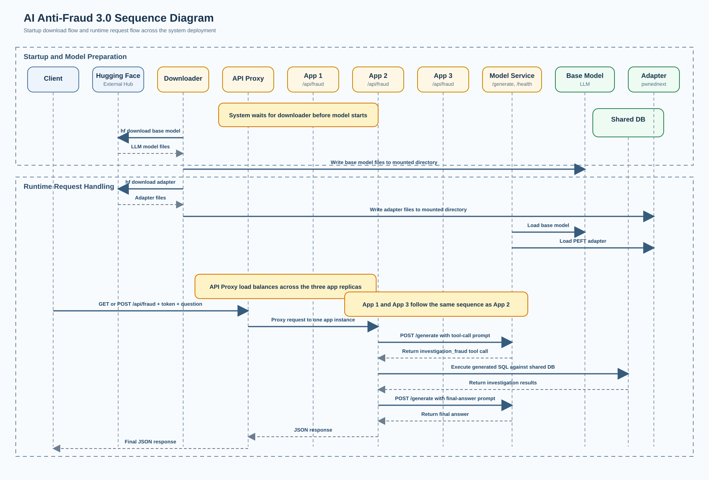
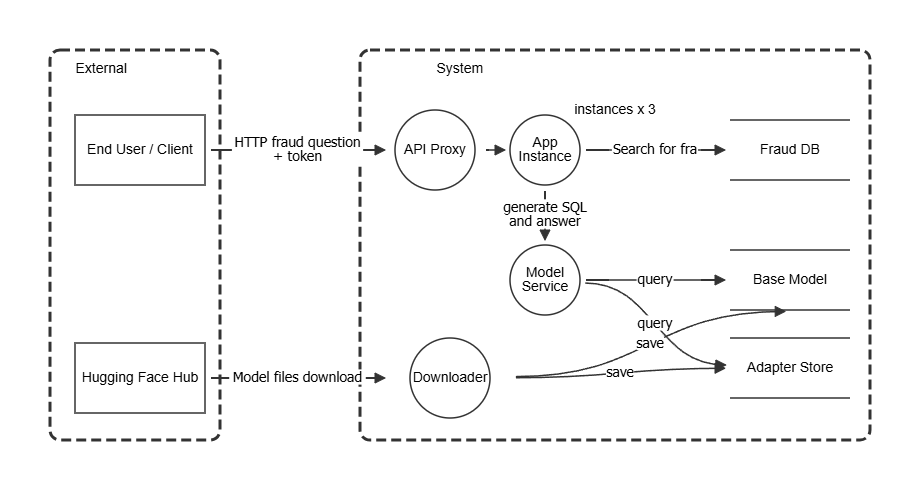

# PwnedNext - LLM App Cheat Sheet

## High-Level Architecture of AI Anti-Fraud 3.0 - Backend

For mobile, see each vulnerable mobile applications.

## License

This work is a derivative of OWASP Cornucopia, used under the Creative Commons Attribution-ShareAlike 4.0 International (CC BY-SA 4.0) license. 
This derivative work is also published under the same CC BY-SA 4.0 license.
While this license explicitly permits free commercial use, a significant amount of time and effort went into adapting and maintaining this resource.
If your organization derives commercial value from this material (e.g., for internal training, client audits, or commercial services), we kindly request that you consider supporting our ongoing work with a [voluntary donation](https://owasp.org/donate/?reponame=cornucopia&title=OWASP+Cornucopia).
